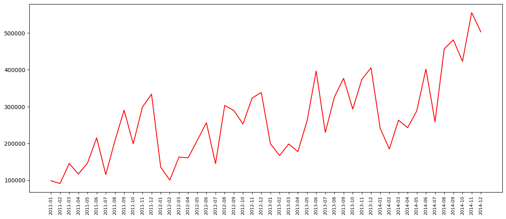
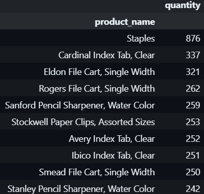
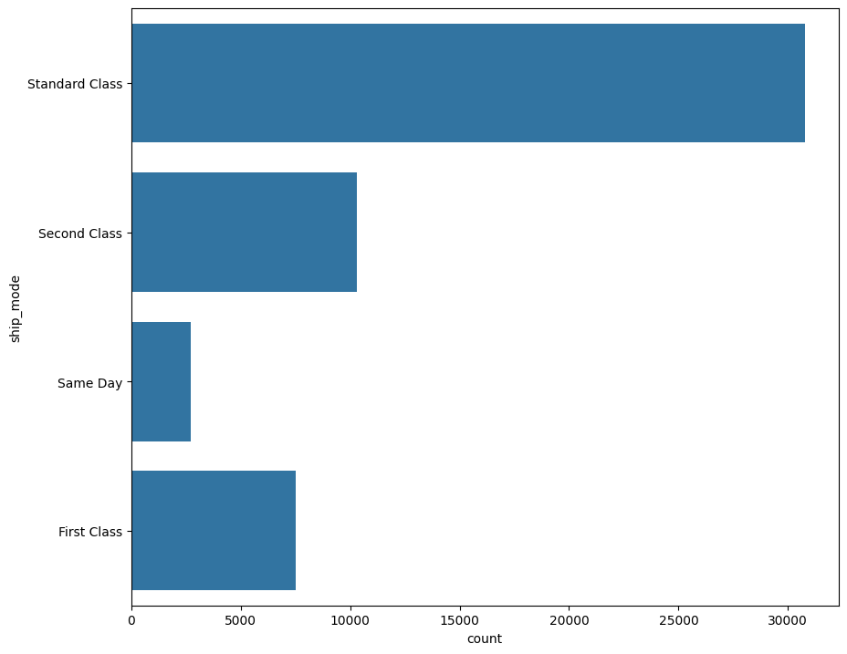
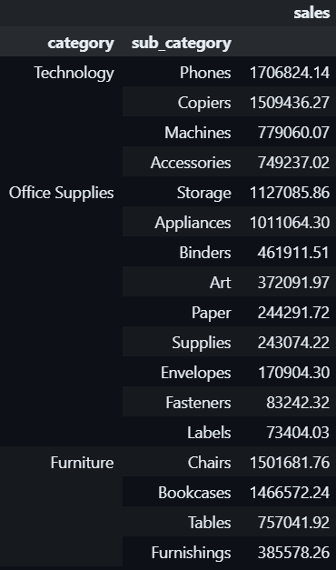

# Superstore Sales EDA Project

## Overview

This Exploratory Data Analysis (EDA) project aims to analyze the sales data of a superstore and gain insights into various aspects of its operations. The dataset used in this analysis is derived from a Superstore Sales Excel file.

## Dataset Description

- **File:** superstore_sales.xlsx
- **Columns:**
  - `Order Date`: Date of the order
  - `Category`: Product category
  - `Sub-Category`: Product sub-category
  - `Sales`: Sales amount
  - `Product Name`: Name of the product
  - `Shipping Mode`: Mode of shipping

## Questions Explored

### 1. Overall Sales Trend

To understand the overall sales trend, the sales data was aggregated on a monthly basis.

### 2. Top 10 Products by Sales

The top 10 products were identified based on their sales amounts. This information provides insights into 

### 3. Most Selling Products

Identification of the most selling products allows the superstore to focus on popular items and optimize inventory. The analysis revealed 
the most selling products as follows :

### 4. Preferred Shipping Mode

Understanding the preferred shipping mode helps in optimizing logistics and improving customer satisfaction. The analysis revealed .

### 5. Most Profitable Categories and Subcategories

To identify the most profitable categories and subcategories, the sales data was aggregated accordingly. The analysis indicated :

## Conclusion

This EDA project provided valuable insights into the sales data of the superstore, including the overall sales trend, top-selling products, preferred shipping mode, and profitable product categories. These insights can guide business decisions and strategies to enhance the overall performance of the superstore.

Feel free to further explore the data and derive additional insights based on the specific needs of the business.

